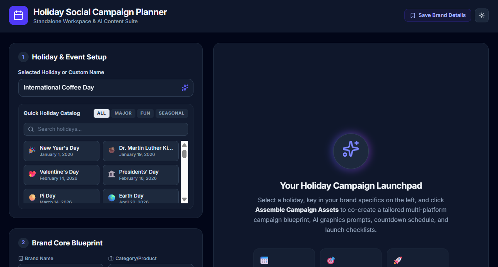

# 📅 Holiday Social Campaign Planner
### *Standalone Workspace & AI Content Suite*

An interactive campaign planner and AI content generator designed for social media managers to design, schedule, and preview holiday-themed marketing campaigns. Built with a high-fidelity **Cosmic Slate Theme** that transitions smoothly between responsive **Light and Dark Modes**.



---

## 🎨 Application Views & Core Layout

The application utilizes a balanced, responsive **Desktop-First / Two-Column Layout** with sleek visual indicators, spacious margins, and smooth interactive transitions:

### 1. Left Control Panel (Inputs & Strategy)
*   **Holiday & Event Setup Panel**: Includes an interactive search bar, a categorized catalog selector (`All`, `Major`, `Fun`, `Seasonal`), and custom input.
*   **Brand Core Blueprint**: Customizable profile parameters for:
    *   *Brand Name* (e.g. Brew & Bolt)
    *   *Product Category/Type* (e.g. Coffee shop)
    *   *Target Audience* (e.g. Remote workers)
    *   *Tone of Voice* (e.g. Playful & Energetic)
    *   *Custom Campaign Objectives / Offers* (text-area input for special discounts or specific copywriting hooks).
*   **Action Command Bar**: Contains the primary **Assemble Campaign Assets** button, with live status indicator sequences.

### 2. Right Workspace Output Panel (Dynamic Previews)
Once assets are assembled, the workspace opens into four modular interactive tabs:
*   **📱 Social Feed Simulator**:
    *   High-fidelity native visual card simulators for **Instagram**, **LinkedIn**, and **X (Twitter)**.
    *   **Post Copywriter Workshop**: An inline text-editor with real-time character count and one-click clipboard copying.
    *   **Graphics Generation Lab**: An prompt text editor backed by an image generation engine.
*   **⏳ Campaign Countdown Timeline**:
    *   Chronological step-by-step roadmap indicating when tasks should go live relative to the target holiday momentum.
*   **📋 Campaign Operational Checklist**:
    *   Interactive checklist grouped cleanly by Campaign Phases (Pre-Launch, Launch, Post-Launch) with a dynamic progress bar.
*   **📅 Interactive Campaign Calendar**:
    *   A full grid-view monthly calendar highlighting the campaign launch date and individual task slots.
    *   Supports dynamic rescheduling via **drag-and-drop** and custom date shifting.


---

## 🚀 Key Features

*   **⚡ AI-Powered Blueprinting**: Utilizes server-side Google Gemini (`@google/genai`) to generate highly customized multi-platform social media posts, checklists, graphics prompts, and countdown schedules.
*   **🎨 Feed Simulation & Real-time Copywriter**: Real-time visual cards showing sponsored/organic posts matching actual layout dimensions of major socials, equipped with text editors and instant copy states.
*   **🌌 Dual-Theme Slate Atmosphere**: An eye-safe slate interface supporting dark and light themes with state persistent caching.
*   **📅 Dynamic Shifting Calendar**: Set your target launch date via standard date picker, and the calendar instantly adjusts all countdown phases.
*   **🖱️ Drag-and-Drop Task Rescheduling**: Move scheduled tasks dynamically on the calendar to fine-tune your campaign rollout.
*   **💾 Brand Presets Profile Manager**: Save tailored brand combinations to local storage to load or delete presets with one click.

---

## 🛠️ Tech Stack & Architecture

-   **Frontend**: React 19, TypeScript, Tailwind CSS v4, Motion (animations), Lucide Icons
-   **Backend**: Express Server, `@google/genai` TypeScript SDK (server-side API proxies to protect secrets)
-   **Build System**: Vite, esbuild, tsx Node.js runtime

---

## 🎯 Step-by-Step Walkthrough: "Assemble Campaign Assets"

The **Assemble Campaign Assets** feature is the core intelligence of the application, coordinating parameters from the client interface with server-side AI.

### Step 1: Input Setup
1.  **Define Target Holiday**: Search for a predefined holiday (e.g., Earth Day, Winter Clearance, Coffee Fest) or write your own custom name. Set the calendar launch date.
2.  **Input Brand Identity**: Define your brand name, product, audience, and preferred tone of voice.
3.  **Specify Campaign Objectives (Optional)**: Provide custom campaign hooks (e.g. *"20% discount code: COFFEE20"*, *"Focus on eco-friendly paper cups"*).


### Step 2: Triggering Assembly
*   Click **Assemble Campaign Assets**.
*   The button transitions into a loading state, cycling through creative planning quotes (*"Sifting through marketing strategies..."*, *"Weaving your custom brand tone..."*, *"Structuring launch milestones..."*) to provide premium user feedback.
*   The application gathers all parameters and dispatches a JSON payload to the backend route `/api/campaigns/generate`.


### Step 3: Server-side Gemini Reasoning
1.  The Express backend securely retrieves the `GEMINI_API_KEY` from environment variables.
2.  A structured query is sent to the Gemini model to synthesize:
    *   Tailored, platform-specific copy for **Instagram**, **LinkedIn**, and **X (Twitter)**.
    *   A set of AI graphic descriptions and precise prompts optimized for visual engines.
    *   An operational checklist with Pre-Launch, Launch, and Post-Launch tasks.
    *   A chronological timeline with specific timeframe intervals (e.g. `7 Days Before`, `1 Day Before`).
3.  The response is returned in a structured format, preventing parser failures.

### Step 4: Asset Initialization & Layout Shift
*   Once received, the front-end resolves dates for every single timeline step and checklist item relative to your chosen **Campaign Launch Date**.
*   The initial welcome banner transitions out smoothly via Motion, and the active workspace tabs emerge.
*   The **Interactive Calendar** is updated with task markers positioned on the exact calendar days according to their timeline intervals.

### Step 5: Iteration & Customization
*   **Draft Edits**: Tweak copy directly inside the Post Copywriter; the Character Count panel updates instantly.
*   **Generate Graphics**: Run the graphics generator to pull AI-generated art into the simulator cards.
*   **Refine Timeline**: Set a different Campaign Launch date; the calendar shifts all tasks in real-time. Drag and drop any task card on the calendar grid to customize specific release days.

---

## 📦 Local Installation & Setup

1.  **Install dependencies**:
    ```bash
    npm install
    ```

2.  **Configure environment secrets**:
    Create a `.env` file in the root directory and add your key:
    ```env
    GEMINI_API_KEY=your_gemini_api_key_here
    ```

3.  **Run Development Server**:
    ```bash
    npm run dev
    ```

4.  **Build for Production**:
    ```bash
    npm run build
    npm run start
    ```